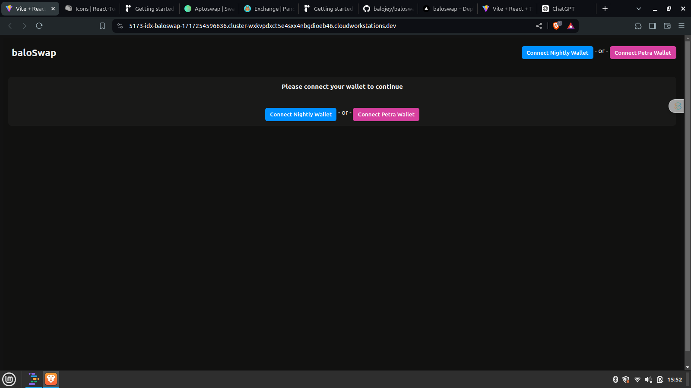
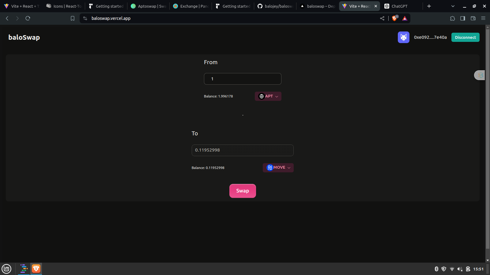
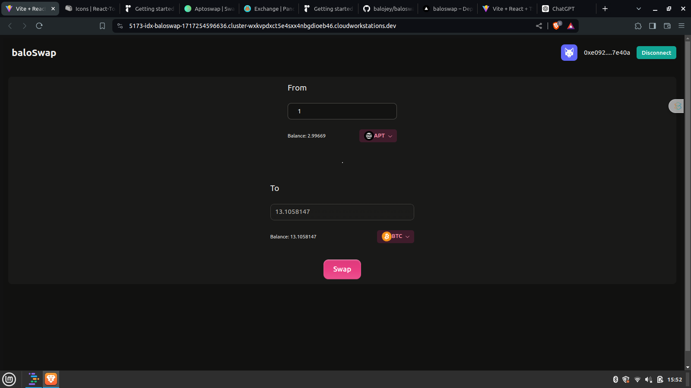

# BaloSwap

[Live app](https://baloswap.vercel.app)

[Video Demo](https://www.loom.com/share/184f813850b44eb3a6d30b8d98a4d711?sid=6d502d22-1d82-4a49-a1d3-f69bb092b0f2)

 BaloSwap is an Aptos Token Swap Interface: a decentralized application (dApp) that enables users to seamlessly swap tokens on the Aptos blockchain. Developed using TypeScript, Radix UI, the Aptos Typescript SDK and the Aptos React Wallet Adapter, this user-friendly platform allows for easy wallet connection, token selection, and transaction execution.

**Key Features:**
- **Wallet Integration:** Securely connect and interact with your Aptos wallet using the Aptos React Wallet Adapter.
- **Token Selection:** Choose from a variety of tokens available on the Aptos blockchain.
- **Amount Specification:** Input precise amounts for token swaps to ensure accurate transactions.
- **Real-time Updates:** Receive instant feedback and updates on swap transaction statuses.
- **Intuitive UI:** Enjoy a streamlined and visually appealing interface built with Radix UI for a superior user experience.

Experience fast, secure, and efficient token swaps with our Aptos Token Swap Interface.

## Setup

1. Clone repo and change directory:
```bash
  git clone https://github.com/balojey/baloswap ; cd baloswap
```
2. Install depedencies and run app:
```bash
  npm install ; npm run dev
```

## Demo







Thanks.
